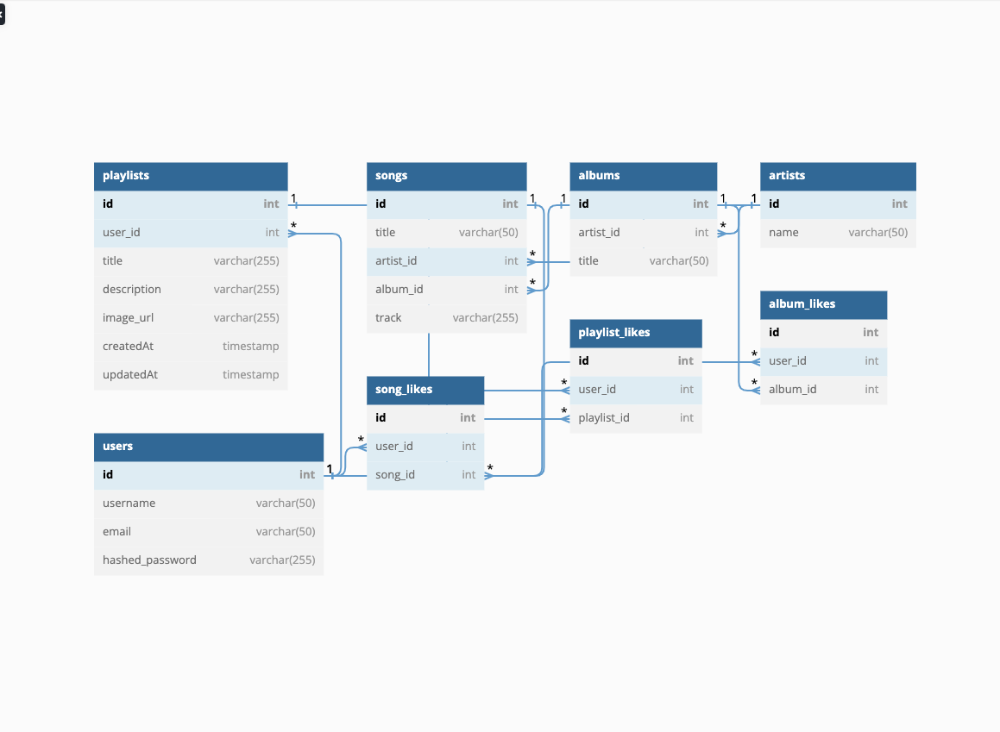

 # Flask React Project

### SCHEMA


This is the starter for the Flask React project.

## Getting started
1. Clone this repository (only this branch)

2. Install dependencies

      ```bash
      pipenv install -r requirements.txt
      ```

3. Create a **.env** file based on the example with proper settings for your
   development environment

4. Make sure the SQLite3 database connection URL is in the **.env** file

5. This starter organizes all tables inside the `flask_schema` schema, defined
   by the `SCHEMA` environment variable.  Replace the value for
   `SCHEMA` with a unique name, **making sure you use the snake_case
   convention**.

6. Get into your pipenv, migrate your database, seed your database, and run your Flask app

   ```bash
   pipenv shell
   ```

   ```bash
   flask db upgrade
   ```

   ```bash
   flask seed all
   ```

   ```bash
   flask run
   ```

7. To run the React App in development, checkout the [README](./react-app/README.md) inside the `react-app` directory.

## MVP List

Spotify8, a Spotify clone, is a website for users to share and listen to music, create playlists, and search for songs, albums, artists, and playlists.<p>
Live site: [Spotify8](https://spotify8-clone-941w.onrender.com/)<p>


## 1. New account creation, log in, log out, and guest/demo login

* Users can sign up, log in, and log out.
* Users can use a demo log in to try the site.
* Users can't use certain features without logging in.
* Logged in users are directed to their profile page which displays their music.
* Logged out users are directed to the homepage consisting of albums and playlists.
* Demo button for logging in.

## 2. Songs

* Logged in user can add a song.
* Logged in users can edit and delete their own song.
* Logged in users can like a song.

## 3. Playlists

* Logged in users can make playlists.
* Logged in users can edit and delete their own playlists.
* All users can view and like other on playlists.

## 4. Search

* Users can search for songs, playlists, and albums.

## 5. Continuous Play

* Songs shouldn't play if the user is not logged in.
* Song should play as you navigate through the pages of the app.

## USER STORIES

## Users

### Sign Up

* As an unregistered and unauthorized user, I want to be able to sign up for the website via a sign-up form.
  * When I'm on the `/signup` page:
    * I would like to be able to enter my email, username, and preferred password on a clearly laid out form.
    * I would like the website to log me in upon successful completion of the sign-up form.
      * So that I can seamlessly access the site's functionality
  * When I enter invalid data on the sign-up form:
    * I would like the website to inform me of the validations I failed to pass, and repopulate the form with my valid entries (except my password).
    * So that I can try again without needing to refill forms I entered valid data into.

### Log in

* As a registered and unauthorized user, I want to be able to log in to the website via a log-in form.
  * When I'm on the `/login` page:
    * I would like to be able to enter my email and password on a clearly laid out form.
    * I would like the website to log me in upon successful completion of the lob-up form.
      * So that I can seamlessly access the site's functionality
  * When I enter invalid data on the log-in form:
    * I would like the website to inform me of the validations I failed to pass, and repopulate the form with my valid entries (except my password).
      * So that I can try again without needing to refill forms I entered valid data into.

### Demo User

* As an unregistered and unauthorized user, I would like an easy to find and clear button on both the `/signup` and `/login` pages to allow me to visit the site as a guest without signing up or logging in.
  * When I'm on either the `/signup` or `/login` pages:
    * I can click on a Demo User button to log me in and allow me access as a normal user.
      * So that I can test the site's features and functionality without needing to stop and enter credentials.

### Log Out

* As a logged in user, I want to log out via an easy to find log out button on the navigation bar.
  * While on any page of the site:
    * I can log out of my account and be redirected to a page displaying the home page.
      * So that I can easily log out to keep my information secure.

## Songs

### Create Songs

* As a logged in user, I want to be able to post new Songs.
  * When I'm on the `/new-song` page:
    * I can write and submit a new song.
    * I can attach that song to an artist and an album

### Viewing Songs

* As a logged in _or_ logged out user, I want to be able to view a selection of Songs.
  * When I'm on the  `/` page:
    * I can see albums, plalists, and artists
    * I can click on these and see the songs or albums associated.
  * When I'm on the `/<int:album_id>` page:
    * I can view the songs of the album.
    * I can view the artist of the album and songs

  * When I'm on the `/playlists/<int:playlist_id>` page:
    * I can view the songs within the playlist.
    * I can see the maker of the playlist
    * I can see the associated information of the each song.

### Updating Songs

* As a logged in user, I want to be able to edit my Songs by clicking an Edit button associated with the Song anywhere that Song appears.
  * When I'm on the `/playlist/<int:playlist_id>` or `/albums/<int:album_id>` pages:
    * I can click "Edit" to make permanent changes to the Song I have posted.
      * So that I can edit the name, album, artist, and song info.

### Deleting Songs

* As a logged in user, I want to be able to delete my Songs by clicking a Delete button associated with the Song anywhere that Song appears.
  * When I'm on the `/playlist/<int:playlist_id>` or `/albums/<int:album_id>` pages:
    * I can click "Delete" to permanently delete a Song I have posted.

## Playlists

### Create Playlists

* As a logged in user, I want to be able to post new Playlists.
  * When I'm on the `/new-playlist` page:
    * I can make and submit a new playlist.
    * I can attach that song to a playlist

### Viewing Playlists

* As a logged in _or_ logged out user, I want to be able to view a selection of Playlists.
  * When I'm on the  `/` page:
    * I can see playlists on the navigation bar and body.
    * I can click on these and see the songs associated.

  * When I'm on the `/playlists/<int:playlist_id>` page:
    * I can view the songs within the playlist.
    * I can see the maker of the playlist
    * I can see the associated information of the each song.

### Updating Playlists

* As a logged in user, I want to be able to edit my Playlists by clicking an Edit button associated with the Playist anywhere that Playlist appears.
  * When I'm on the `/playlist/<int:playlist_id>` or `/albums/<int:album_id>` pages:
    * I can click "Edit" to make permanent changes to the Playlist I have posted.
      * So that I can change the playlist whenever I like.

### Deleting Playlists

* As a logged in user, I want to be able to delete my Playlists by clicking a Delete button associated with the Playlist anywhere it appears.
  * When I'm on the `/playlist/<int:playlist_id>` or `/albums/<int:album_id>` pages:
    * I can click "Delete" to permanently delete a Playlist I have created.

## Search Bar

### Searching the App

* As a user, I want to be able to search the app for songs, playlists, albums, and artists associated with a text input.

## Continous Play

### Continous Play

* As a logged in user, I want to  be able to continuously play tracks as I navigate the site.

### SCHEMA

### How to contribute?
* Clone the repo locally
  ```
  git clone https://github.com/YElnadi/Flask_Project.git
  ```
* CD to the created folder, you should be on the main branch
  ```
  git branch
  ```
* Create a branch with the naming convention `<initials>-<small-description>`
  ```
  git checkout -b ye-how-to-contribute
  ```
* Make your edits and commit your code
  ```
  git add *
  git commit -m "<some-description>"
  ```
* Push to remote
  ```
  git push
  ```
* If this is the first time to push, copy the generated command
  ```
  git push --set-upstream origin ye-how-to-contribute
  ```
* Go to github repo page, click on the shown button `Compare & pull request`
* In the page that opens, add a title and description to your change
* At least 1 reviewer is required
* Ask others in the team to review and approve your code
* Once approved, click on `Merge pull request` -- better `Squash and merge`
* Once the PR is merged, other people can start pulling your changes using
  ```
  git checkout main
  git pull
  ```

  
